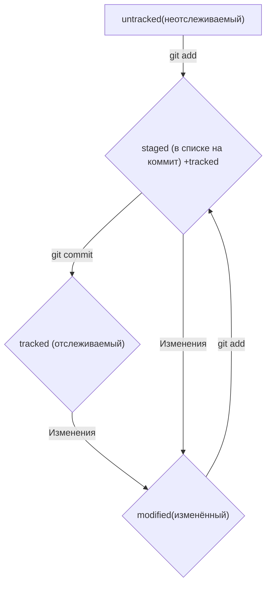

# Небольшая шпора по работе с Git-ом

## Основные команды:
* Общее
1. clear — Очистить консоль

* Навигация
1. pwd — Показать текущий каталог
2. ls - Показать файлы в данной папке, кроме скрытых
3. ls -f — Показать файлы в данной папке, включая и скрытые
4. cd c:/ — Перейти в конкретный каталог
5. cd - — Вернуться назад
6. cd .. — Выйти на 1 уровень вверх

* Создание/удаление
1. mkdir — Создать папку
2. touch ... — Создать файл …
3. rmdir … - удалить пустую папку(если папка не пустая - ничего не произойдет)
4. rm -r ... - удалить папку и все, что внутри

* Работа с репозиториями
1. git init - инициализация локального репозитория
2. git status - сводка о состоянии файлов
3. git add ... - отслеживание файла ...
4. git commit (-m "message") - фиксация изменений; 
5. git push - отправка изменений на удаленный репозиторий
6. git log - история фиксации изменений

Простыми словами: репозиторий - папка, изменения в которой мы хотим отслеживать. Для начала, эту папку нужно выбрать (cd) и инициализировать (git init). Далее с помощью git add мы можем начать отслеживать интересующие нас файлы. Затем мы можем зафиксировать текущее состояние отслеживаемых файлов с помощью git commit. Синхронизация локального и удаленного репозиториев происходит с помощью git push.

Стрелочками вверх-вниз можно выбирать введенные раньше команды; с помощью Tab-а - вводить только первые пару букв команд.

**Хэш** - основной идентификатор коммита, уникальный набор символов, содержащий всю информацию о коммите.  
В логах хранится информация о времени коммита, его авторе, хэше и сообщении.  
В сокращенных логах (-oneline) хранится сокращенный хэш и сообщение коммита.  
**HEAD** - файл, указатель на последний коммит.  

* **4 состояния файлов:**
1. untracked - файл не отслеживается.  
2. tracked - файл отслеживается.  
3. staged - файл попал в список файлов, которые войдут в коммит.  
4. modified - текущая версия файла не совпадает с уже предыдущей.  
Файл может быть одновременно в нескольких состояниях.

С помощью git status можно следить за состоянием untracked, staged, modified файлов в репозитории.

Сообщения к коммитам должны быть относительно короткими и информативными, придерживаться определенного стиля написания.🎉